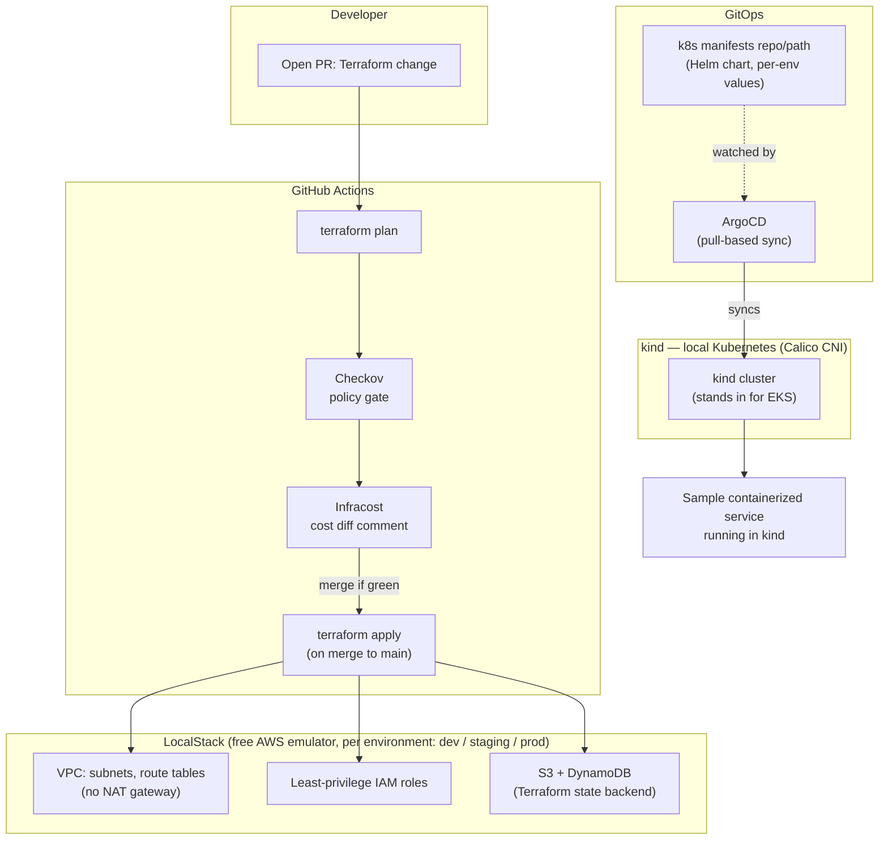

# CloudForge — Multi-Environment Cloud Infrastructure Platform

CloudForge is a multi-environment cloud infrastructure platform: Terraform provisions dev/staging/prod on AWS behind a policy-as-code gate that blocks non-compliant changes before merge, cost estimates get posted automatically on every infrastructure PR, and ArgoCD handles GitOps deployment onto the resulting Kubernetes cluster.

Built for **$0** — no AWS account, no credit card, no risk of a surprise bill. LocalStack emulates AWS locally, and `kind` stands in for EKS. The Terraform, policy-as-code, cost-estimation, and GitOps work is 100% real; only the cloud backend is swapped for a free local emulator during development.

## The Problem This Solves

Most teams provision infrastructure by hand or with ad-hoc scripts, so `dev`, `staging`, and `prod` drift apart into environments that aren't actually the same. Nothing stops a risky change — a public S3 bucket, an overly broad IAM policy — from merging straight into production, because the only gate is a human reviewer who might miss it. Misconfigured cloud storage and IAM permissions are behind a large share of real-world data breaches. On the cost side, engineers routinely have no idea what a Terraform change will cost until the bill arrives.

CloudForge makes environments reproducible by construction (Terraform, not console-clicking), makes risky changes fail *before* merge instead of after deploy (policy-as-code), and makes cost visible at decision time instead of at invoice time (Infracost).

## Architecture



**How it flows:** a developer opens a PR changing Terraform → CI runs `plan` → a policy-as-code check fails the PR if the plan violates a rule (public bucket, wildcard IAM, missing tags) → Infracost posts the estimated monthly cost delta as a PR comment → on merge, `apply` runs against LocalStack, provisioning the VPC/IAM/state resources for that environment. Separately, the sample service is built, tested, scanned, and pushed to GHCR by its own CI pipeline, then deployed onto a local `kind` cluster — ArgoCD watches the `k8s/` manifests in Git and pulls changes into the cluster itself (GitOps: the cluster pulls, nothing pushes into it).

Full reasoning behind every choice below — including the ones forced by a constraint and the ones found the hard way — is in [`docs/design-decisions.md`](docs/design-decisions.md).

## Tech Stack

| Layer | Tool | Role |
|---|---|---|
| Infrastructure | **Terraform** | Declares VPC, IAM, S3/DynamoDB state backend, per environment |
| Cloud emulation | **LocalStack** | Free local AWS emulator — Terraform talks to it exactly like real AWS |
| Governance | **Checkov** | Policy-as-code — fails CI on non-compliant Terraform, including two custom rules |
| Cost | **Infracost** | Posts a cost estimate/diff as a PR comment, straight from the Terraform plan |
| CI/CD | **GitHub Actions** | Runs plan → policy check → cost comment → apply; also builds/tests/scans/pushes the app image |
| Containers | **Docker** | Multi-stage builds for the sample service; also runs LocalStack and kind |
| Kubernetes | **kind** | Free local Kubernetes cluster, stands in for EKS |
| Templating | **Helm** | Per-environment values (replica counts, resource limits) on one shared chart |
| GitOps | **ArgoCD** | Pull-based deployment — cluster syncs itself from Git, nothing pushes in |
| Security scanning | **Trivy** | Scans the built container image for known CVEs before it's pushed |
| Registry | **GHCR** | Hosts the built, scanned container image |

## What's Built and Verified

Everything below has actually been applied and observed running, not just written.

### Infrastructure
- **LocalStack** running via Docker Compose as the AWS target (S3, DynamoDB, IAM, EC2, STS)
- **Remote state backend** — versioned S3 bucket plus a DynamoDB lock table, bootstrapped once with local state since it cannot store its own
- **Three environments applied** — `dev`, `staging`, `prod`, 22 resources each, isolated state keys and non-overlapping CIDRs (`10.0/16`, `10.1/16`, `10.2/16`)
- **`vpc` module** — public and private subnets across 2 AZs, route tables, internet gateway, an app security group with enumerated egress, and the VPC default security group emptied. **No NAT gateway**, by design
- **`iam` module** — an app role and a CI role, both least-privilege. No wildcard appears in any action or resource
- **`app_bucket` module** — public access blocked, encrypted, versioned, with lifecycle expiry, so all three environments are hardened identically
- **`eks` module** — real AWS syntax with KMS-encrypted secrets and full control-plane logging. Validated, deliberately never applied

### Delivery
- **Go service** with health and CRUD endpoints, multi-stage build into a distroless image running as a numeric non-root UID
- **`app-ci.yml`** — test, build, Trivy scan failing on CRITICAL/HIGH, then GHCR push gated to `main`
- **kind cluster** running Kubernetes 1.33 with **Calico**, because kind's default CNI accepts NetworkPolicy objects and enforces none of them
- **Helm chart** deployed to three namespaces with per-environment values — dev/staging/prod run 1/2/3 replicas from one chart
- **NetworkPolicies** — default-deny ingress plus one narrow allow, actually enforced
- **HPA verified under load**: staging scaled 2 → 5 pods at 148% CPU against a 60% target, then back down. Evidence in [`docs/evidence/hpa-scaling.txt`](docs/evidence/hpa-scaling.txt)
- **ArgoCD v3.5.2** installed in-cluster with App-of-Apps manifests for all three environments

### Governance
- **Checkov gate** — 110 checks passing, 0 failing, with two custom rules: an `Environment` tag requirement and an approved instance-type list. The tag rule immediately caught a real gap (an untagged state bucket)
- **Policy self-test** — a second CI job runs the same policies against deliberately broken fixtures in `policy/tests/` and fails the build if they come back clean. A gate nobody tests is a gate that can silently stop gating
- **`terraform-plan.yml`** — fmt, validate and plan per environment, plan posted as a PR comment, plus the policy and cost jobs
- **`terraform-apply.yml`** — runs LocalStack as a service container, so CI performs a genuine end-to-end apply rather than a dry run
- **Infracost** wired into the plan workflow for a cost delta on every PR

### Not yet done
- The repo has no GitHub remote, so no workflow has run for real and ArgoCD cannot sync — its Applications point at a repository that does not exist yet
- Infracost needs an API key stored as a repository secret
- Screenshots and GIFs for the pull-request evidence still need capturing

## Definition of Done

- [x] Three environments (dev/staging/prod) exist as distinct, isolated Terraform state, sharing the same modules
- [x] HPA autoscaling demonstrated under load — [`docs/evidence/hpa-scaling.txt`](docs/evidence/hpa-scaling.txt)
- [x] A real (unapplied) `eks` Terraform module exists in the repo, documented as the production path
- [x] A policy-as-code violation is caught by the gate — proven locally and enforced by the `policy-self-test` CI job
- [x] README has the architecture diagram, setup instructions, and the LocalStack/kind honesty note
- [x] `terraform apply` from a clean state reproduces the entire environment identically — [`docs/evidence/rebuild-from-scratch.txt`](docs/evidence/rebuild-from-scratch.txt)
- [ ] The policy violation blocks a real **pull request** — needs a GitHub remote, then a screenshot
- [ ] An Infracost comment appears on a real PR — needs an API key, then a screenshot
- [ ] ArgoCD auto-syncs an application change end-to-end after merge — needs the repo pushed, then a GIF
- [ ] Public GitHub repo with real, incremental commit history

## Why LocalStack and kind Instead of Real AWS/EKS

The Terraform is written against the real AWS provider API — the HCL is identical to what would run against a real account. LocalStack and kind let me develop and demo the whole platform without incurring cloud costs during a job search. The `eks` module is in the repo, documented, and I can walk through exactly what changes to point it at a real account. The two AWS resources that always cost money with no free tier — the EKS control plane (~$73/month) and NAT Gateways — are avoided entirely by design.

## Repo Structure

```
cloudforge/
├── terraform/
│   ├── modules/          (vpc, iam, app_bucket, eks)
│   ├── envs/             (dev, staging, prod)
│   └── bootstrap/        (one-time state backend setup)
├── policy/               (deliberately outside terraform/, see note below)
│   ├── .checkov.yaml     (the gate: skips carry reasons)
│   ├── custom_checks/    (two custom rules, YAML format)
│   └── tests/            (broken-on-purpose fixtures the gate must reject)
├── k8s/
│   ├── base/             (Helm chart)
│   ├── overlays/         (dev, staging, prod values)
│   ├── kind-cluster.yaml (default CNI disabled, Calico instead)
│   └── loadtest.yaml     (reproduces the autoscaling demo)
├── app/                  (sample Go service + Dockerfile)
├── argocd/
│   ├── root-app.yaml     (App-of-Apps root)
│   └── apps/             (one Application per environment)
├── docs/
│   ├── design-decisions.md  (why it is built this way)
│   └── evidence/            (captured proof: autoscaling, etc.)
├── .github/
│   └── workflows/
│       ├── terraform-plan.yml   (plan + policy + cost, on PR)
│       ├── terraform-apply.yml  (on merge to main)
│       └── app-ci.yml           (build/test/scan/push the sample service)
└── docker-compose.yml    (LocalStack + local app dev loop)
```

**Why `policy/` sits outside `terraform/`:** the gate scans `terraform/`, and `policy/tests/` contains configuration that is broken on purpose. Keeping the fixtures out of the scanned tree means the main scan stays clean without needing skip rules that could accidentally hide real findings.

## Running It Locally

Prerequisites: Docker, `terraform` (>= 1.6 — the S3 backend `endpoints` block needs it), `kubectl`, `helm`, `kind`.

```bash
# 1. Bring up the local AWS emulator
cp .env.example .env          # add a LocalStack auth token if you have one
docker compose up -d
curl http://localhost:4566/_localstack/health

# 2. Create the state backend, then every environment
terraform -chdir=terraform/bootstrap init
terraform -chdir=terraform/bootstrap apply -auto-approve

for env in dev staging prod; do
  terraform -chdir=terraform/envs/$env init
  terraform -chdir=terraform/envs/$env apply -auto-approve -var-file=$env.tfvars
done

# 3. Kubernetes: cluster, CNI, image, workloads
kind create cluster --config k8s/kind-cluster.yaml
kubectl apply --server-side -f https://raw.githubusercontent.com/projectcalico/calico/v3.30.0/manifests/calico.yaml
kubectl wait --for=condition=Ready nodes --all --timeout=300s

docker build -t cloudforge-app:latest ./app
kind load docker-image cloudforge-app:latest --name cloudforge

for env in dev staging prod; do
  helm upgrade --install $env k8s/base -f k8s/overlays/$env/values.yaml \
    -n $env --create-namespace --wait
done

# 4. Autoscaling needs metrics; kind needs the insecure-TLS flag
kubectl apply -f https://github.com/kubernetes-sigs/metrics-server/releases/latest/download/components.yaml
kubectl patch deployment metrics-server -n kube-system --type=json \
  -p='[{"op":"add","path":"/spec/template/spec/containers/0/args/-","value":"--kubelet-insecure-tls"}]'

# 5. GitOps
kubectl create namespace argocd
kubectl apply -n argocd -f https://raw.githubusercontent.com/argoproj/argo-cd/stable/manifests/install.yaml
```

Run the policy gate the way CI does:

```bash
pip install checkov
checkov --config-file policy/.checkov.yaml          # must pass
checkov -d policy/tests --external-checks-dir policy/custom_checks   # must fail
```

Reproduce the autoscaling demo:

```bash
kubectl apply -f k8s/loadtest.yaml
kubectl get hpa -n staging -w
kubectl delete -f k8s/loadtest.yaml
```

## Known Limitations

- **ArgoCD cannot sync until this repo is pushed.** The Applications reference a GitHub URL; update `repoURL` in `argocd/` to match the real repository.
- **The `eks` module has never been applied.** It is validated against the real AWS provider schema and documented as the production path, but running it would incur real cost.
- **VPC flow logs, KMS customer-managed keys and S3 access logging are deliberately skipped**, each with a reason recorded in `policy/.checkov.yaml`. All three bill continuously on real AWS, which is the same reasoning that removed the NAT gateway.
- **CI has never run.** Both Terraform workflows and the app pipeline are written but untriggered until the repo has a remote.
